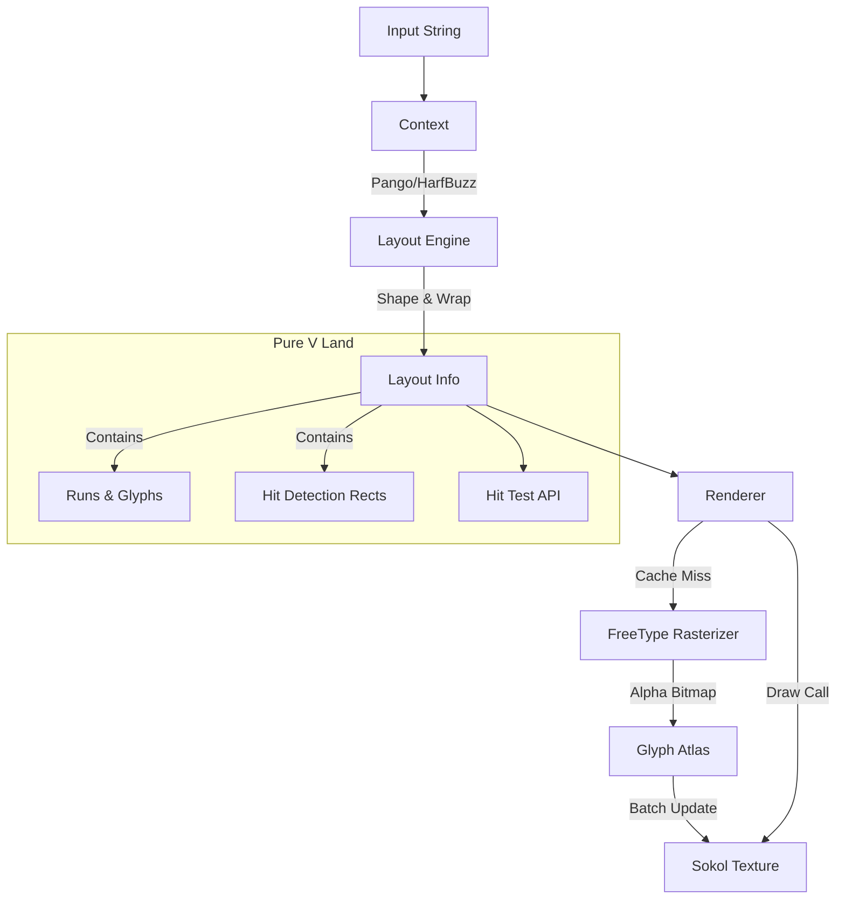

# Text Render

### *This is a work in progress and is not production ready!*

A high-performance, feature-rich text rendering engine for the V programming language, built on top
of **Pango**, **FreeType**, and **Sokol**.

This library provides production-grade text layout capabilities, including bidirectional text
support (Arabic/Hebrew), complex script shaping, text wrapping, rich text markup, and sub-pixel
accurate rendering, while maintaining a pure V-friendly API.

## Prerequisites

This library relies on **Pango** and **FreeType**. You must have these installed on your system.

### macOS (Homebrew)
```bash
brew install pango freetype pkg-config
```

### Linux (Debian/Ubuntu)
```bash
sudo apt-get install libpango1.0-dev libfreetype6-dev pkg-config
```

### Linux (Fedora)
```bash
sudo dnf install pango-devel freetype-devel pkgconf-pkg-config
```

## Architecture

The system is designed to decouple **Text Layout** from **Text Rendering**. This separation allows
for efficient hit-testing and layout calculations without needing an active graphics context, and
batched rendering for high performance.

### Data Flow



### Key Components

1.  **Context (`text_render.Context`)**: 
    - Manages the connection to Pango and FontConfig.
    - Responsible for the heavy lifting of text shaping, wrapping, and laying out.
    - Produces a `Layout` object.

2.  **Layout (`text_render.Layout`)**:
    - A lightweight, pure V struct containing all necessary information to draw text or perform hit
      tests.
    - Stores text as "Runs" (`Item`), which contain shaped "Glyphs".
    - Stores "Baked" Character Rectangles (`CharRect`) for O(1) or O(N) hit testing without querying
      Pango again.

3.  **Renderer (`text_render.Renderer`)**:
    - Manages the `GlyphAtlas` (dynamic texture packing) and Glyph Cache.
    - Renders `Layout` objects to the screen using Sokol `gg`.
    - Handles color tinting and texture coordinates.

4.  **Glyph Atlas**:
    - Dynamically packs grayscale bitmaps of glyphs into a single GPU texture.
    - Uses a "dirty" flag system to batch uploads, ensuring only one `sg_update_image` call per
      frame (sokol requirement).

## Rich Text Markup

The library supports **Pango Markup**, allowing you to style text using XML-like tags. Enable this
by setting `use_markup: true` in your `TextConfig`.

### Supported Tags

*   `<b>`, `<strong>`: **Bold**
*   `<i>`, `<em>`: *Italic*
*   `<u>`: <u>Underline</u>
*   `<s>`: <s>Strikethrough</s>
*   `<tt>`, `<monospace>`: Monospace font
*   `<big>`, `<small>`: Relative font size changes
*   `<sup>`, `<sub>`: Superscript and Subscript
*   `<span>`: General span for applying attributes

### Supported Attributes (in `<span>`)

*   `foreground`: Text color (name, hex, or rgb style). Example: `#FF0000`, `blue`.
*   `background`: Background color (highlight). Example: `yellow`, `#00FF00`.
*   `underline`: Style of underline (`none`, `single`, `double`, `low`, `error`).
*   `strikethrough`: `true` or `false`.
*   `font_desc`: Full font description string. Example: `Sans Italic 12`.
*   `size`: Font size (absolute or relative words like `small`, `x-large`).
*   `weight`: Font weight (`bold`, `light`, `heavy`, etc.).

**Example Markup:**
```v
markup_text := '<span foreground="blue" size="x-large">Blue</span> ' + '<u>Underline</u> ' +
	'<span background="yellow">Highlight</span>'
```

## Technical Nuances & Discrepancies

### Logical vs. Ink Rectangles (Hit Testing vs. Rendering)
You may observe that certain characters (especially Emojis or script fonts with large swashes)
render outside their hit-test rectangle.

*   **Logical Rectangle (Hit Test)**: This is the typographic "cell" determined by Pango. It ensures
    consistent line spacing and cursor placement. The `Layout.hit_test()` method uses these bounds.
*   **Ink Rectangle (Visual)**: This is the actual bounding box of the pixels drawn. FreeType
    respects the font's vertical bearings (`bitmap_top`), allowing glyphs to "bleed" out of their
    logical line height.

**This is intentional behavior.** It allows for tall emojis to appear native without forcing the
entire line of text to have varying or excessive height, preserving the rhythm of the paragraph.

### Coordinate Systems
*   **Pango Units**: Internally, Pango uses integers scaled by 1024 (`PANGO_SCALE`). The `Layout`
    struct normalizes these to standard floating-point pixels (`f32`) for the user.
*   **RTL Text**: For Right-to-Left languages, Pango may return negative width extents to indicate
    directionality. The library automatically normalizes these into standard positive-width
    rectangles during the "baking" phase of the layout.

### Rendering Cycle
To satisfy Sokol's requirement of a single texture update per frame, the Renderer separates **Draw**
calls from **Commit** calls.
1.  `draw_layout(...)`: Queues quads and loads new glyphs into the CPU-side atlas if needed.
2.  `commit()`: Must be called **once** at the end of the frame to upload any new glyph data to the
    GPU. Not calling this will result in invisible text for newly loaded characters.

## Usage
 
### Simplified Usage (`TextSystem`)

For most use cases, use the high-level `TextSystem` API which handles layout caching and rendering
automatically.

```okfmt
import text_render
import gg

struct App {
mut:
	ctx &gg.Context
	ts  &text_render.TextSystem
}

fn init(mut app App) {
	// Initialize TextSystem with your gg.Context
	app.ts = text_render.new_text_system(mut app.ctx) or { panic(err) }
}

fn frame(mut app App) {
	// Draw text directly - layout is cached internally
	app.ts.draw_text(100, 100, 'Hello High-Level API!', text_render.TextConfig{
		font_name: 'Sans 20'
		align:     .center
	}) or { panic(err) }

	// Upload texture data at end of frame
	app.ts.commit()
}
```

### Advanced Usage (Manual Layout Management)


```okfmt
// 1. Initialize
mut tr_ctx := text_render.new_context()!
mut renderer := text_render.new_renderer(mut gg_ctx)

// 2. Layout Text (Expensive - do this when text changes)
cfg := text_render.TextConfig
{
	font_name: 'Sans 20'
	width:     400
	wrap:      .word
}

layout := tr_ctx.layout_text('Hello World', cfg)!

// 3. Render (Cheap - do this every frame)
renderer.draw_layout(layout, x, y)
renderer.commit()

// 4. Hit Test
index := layout.hit_test(mouse_x, mouse_y)
```