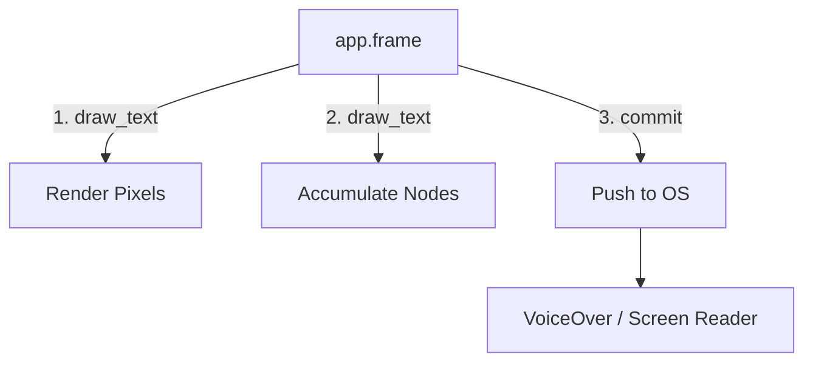

# Accessibility in VGlyph

`vglyph` provides built-in accessibility support, allowing your V applications to automatically 
integrate with screen readers (like VoiceOver on macOS).

## Overview

Text rendered in a graphical application is typically just pixels to an operating system. 
Screen readers cannot see these pixels. `vglyph` bridges this gap by creating a parallel, invisible
"accessibility tree" that mirrors the text you draw on screen.

## Automatic Accessibility

The easiest way to support accessibility is to enable **Automatic Mode**.

### Enabling

In your initialization code:

```v ignore
fn init(mut app App) {
	app.ts = vglyph.new_text_system(mut app.gg)!

	// Enable automatic accessibility integration
	app.ts.enable_accessibility(true)
}
```

### How it Works

Once enabled, every call to `draw_text` or `draw_layout` does two things:
1. Renders the text to the screen (pixels).
2. Adds an invisible node to the accessibility tree describing the text and its location.

At the end of the frame, when you call `app.ts.commit()`, `vglyph` bundles all these nodes and
pushes them to the OS accessibility API.

```v ignore
fn frame(mut app App) {
	app.gg.begin()

	// These lines are automatically exposed to VoiceOver
	app.ts.draw_text(10, 10, 'Username', label_style)!
	app.ts.draw_text(10, 50, 'JohnDoe', input_style)!

	app.gg.end()

	// Pushes the accessibility tree for this frame
	app.ts.commit()
}
```



## Manual Accessibility

If you have complex needs—such as custom controls ensuring order, or grouping
elements differently than draw order—you can manage updates manually.

1. **Disable Automatic Mode** (default state).
2. Call `update_accessibility(layout, x, y)` for each item you want to expose.

```v ignore
// Manual control loop
fn frame(mut app App) {
	// ... drawing code ...

	// Maybe you only want the result to be accessible, not the labels
	app.ts.update_accessibility(result_layout, x, y)

	app.ts.commit()
}
```

## Best Practices

### 1. The `commit()` Call
Just like with visual rendering, `commit()` is the synchronization point. If you
forget to call it, the accessibility tree will not update, and screen readers
will think the window is empty.

### 2. Reading Order
The reading order in the accessibility tree corresponds to the order in which
you call `draw_text` (or `update_accessibility`). Draw/add items from top-left
to bottom-right (or logical reading order) to ensure a good experience for
screen reader users.

### 3. Dynamic Content
Because the tree is rebuilt every frame, dynamic content (like counters or
changing labels) is automatically handled. As soon as the text changes on
screen, the next `commit()` updates the screen reader.

## Current Limitations

- **Grouping**: Currently, all text nodes are essentially siblings in a flat
  list (under the root container).
- **Roles**: All text is currently exposed with the generic "Text" role.
- **Platform Support**: 
  - 🚧 **macOS**: Partially implemented.
  - 🚧 **Windows**: Not yet implemented.
  - 🚧 **Linux**: Not yet implemented.